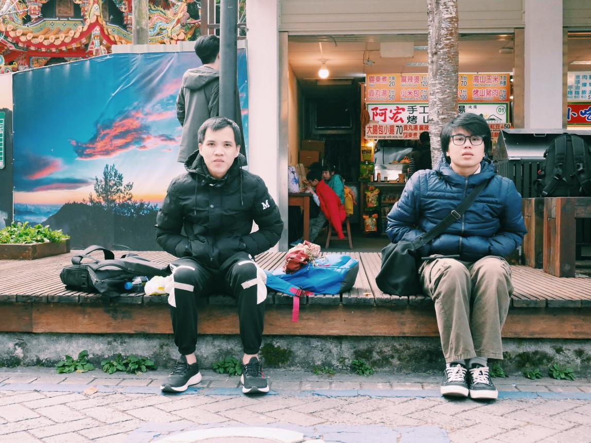

### Hi !!! 

 

I'm [Nguyen Quang Khai](https://www.linkedin.com/in/khaisting/), 👨🏻‍💻 an aspiring **AI/ML Engineer**, focusing on **Natural Language Processing**, **Computer Vision**, and **MLOps**. I’m also an Open-Source enthusiast, with my projects openly available on [GitHub](https://github.com/KhaiBoiPho?tab=repositories).

🎓 Final-year Computer Science student at FPT University, focusing on building **real-world AI systems** — from classical ML to deep learning and recommender systems. I love bridging the gap between research models and **scalable, maintainable products**. Currently exploring opportunities to work on practical AI/ML projects where **performance, deployment, and real-world impact** truly matter.  

 
 

- 🇻🇳 Living in **Ho Chi Minh, Viet Nam**

- When I'm not coding, I’m either racing on two wheels 🏍 or vibing as a “city boy” 🌆.

 

### 📈 GitHub Stats

# 💻Tech Stack
 
 
 
 
 
 
 
 
 
 
 
 
 
 

[Become a sponsor.](https://github.com/sponsors/KhaiBoiPho)

